# Архитектура Web-приложения «Консалтинговая компания»

**Студент:** Плахотников Владимир
**Стек:** PHP 8.2 + MySQL 8.0 + Apache + GD, Docker
**Корень курсового проекта:** `Consulting_Plakhotnikov/`

Документ описывает архитектуру курсового проекта в виде набора схем и диаграмм

---

## Оглавление

1. [Высокоуровневая архитектура](#1-высокоуровневая-архитектура)
2. [ER-диаграмма базы данных](#2-er-диаграмма-базы-данных)
3. [Граф каскадного удаления](#3-граф-каскадного-удаления-on-delete)
4. [Конечный автомат статусов заявки](#4-конечный-автомат-статусов-заявки)
5. [Карта классов (модели)](#5-карта-классов-модели)
6. [Sequence: Авторизация с cookie «Запомнить меня»](#6-sequence-авторизация-с-cookie-запомнить-меня)
7. [Sequence: Создание заявки клиентом](#7-sequence-создание-заявки-клиентом)
8. [Sequence: Назначение консультанта администратором](#8-sequence-назначение-консультанта-администратором)
9. [Sequence: Работа консультанта и формирование отчёта](#9-sequence-работа-консультанта-и-формирование-отчёта)
10. [Sequence: Массовое удаление с чекбоксами](#10-sequence-массовое-удаление-с-чекбоксами)
11. [Sequence: GD-диаграммы в админке](#11-sequence-gd-диаграммы-в-админке)
12. [Карта ролей и разделов сайта](#12-карта-ролей-и-разделов-сайта)

---

## 1. Высокоуровневая архитектура

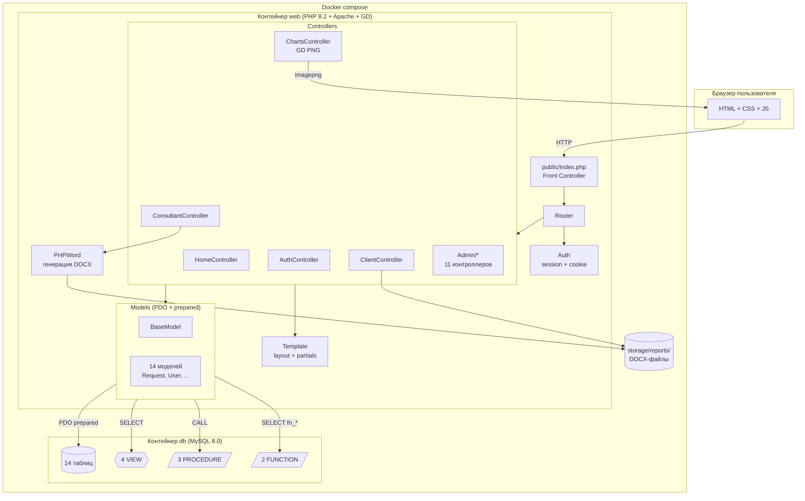

---

## 2. ER-диаграмма базы данных

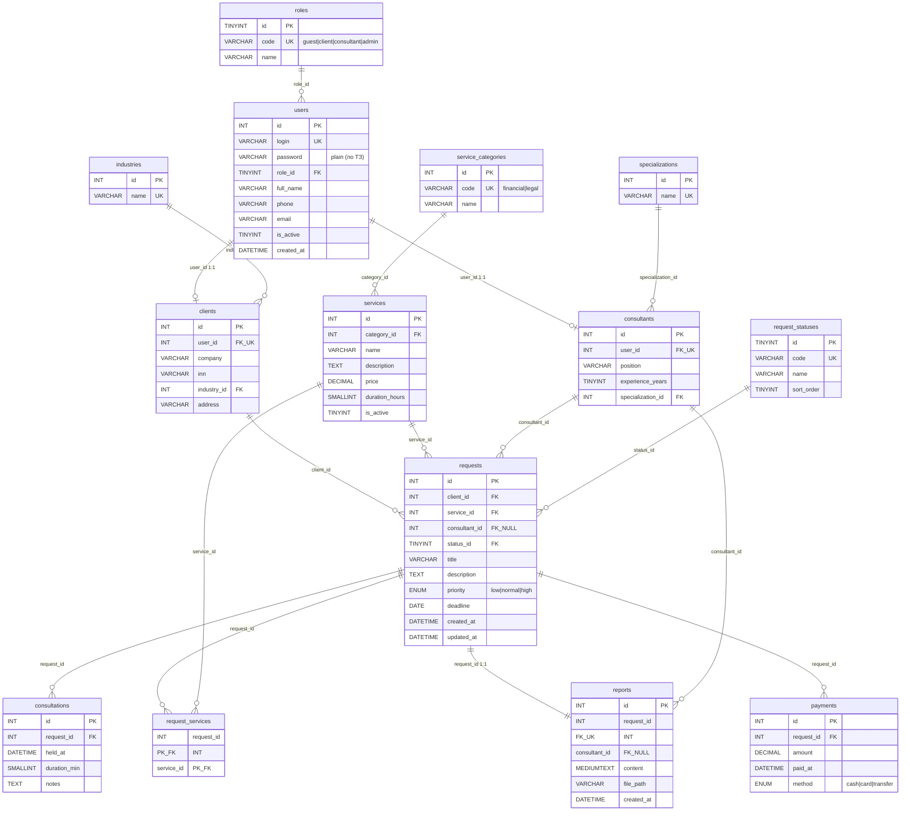

**Условные обозначения связей:**

- `||--o{` — один-ко-многим (обязательная сторона: одна запись слева, ноль или много справа)
- `||--o|` — один-к-одному с опциональной правой стороной (профиль клиента/консультанта)
- `||--||` — один-к-одному обязательный (заявка ↔ отчёт, ограничено `UNIQUE`)

---

## 3. Граф каскадного удаления (ON DELETE)

Стрелка показывает «что удаляется при удалении источника».

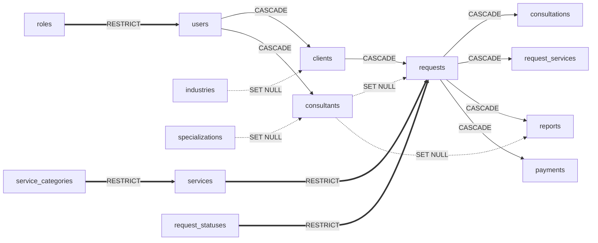

**Легенда:**

- 🟥 **CASCADE** (сплошная стрелка): удалили клиента → удалились его заявки → каскадом удалились консультации, доп. услуги, отчёт и платежи
- 🟨 **SET NULL** (пунктирная): уволили консультанта — его заявки остаются, поле `consultant_id` обнуляется
- 🟦 **RESTRICT** (двойная): нельзя удалить запись из справочника, пока есть ссылки на неё

---

## 4. Конечный автомат статусов заявки

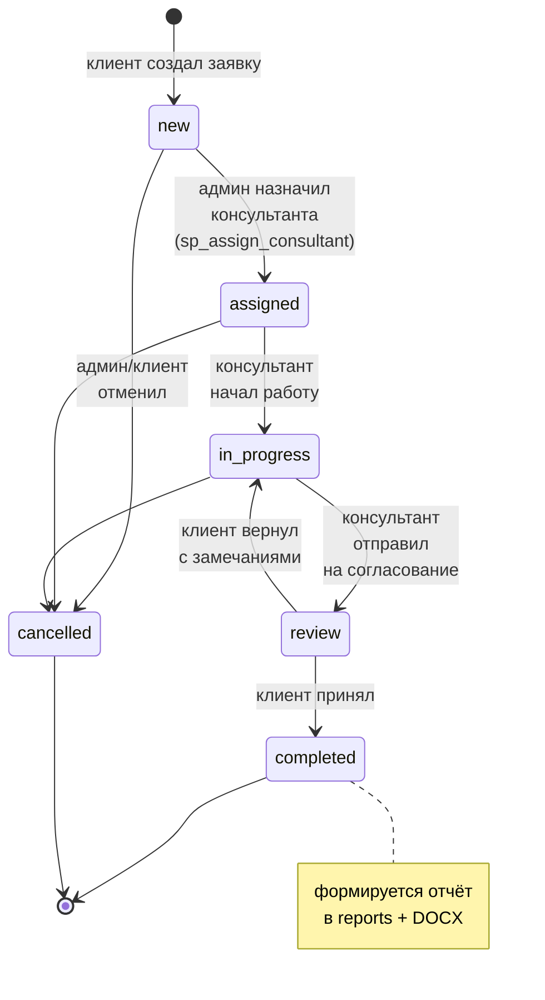

Все переходы выполняются через процедуру `sp_change_status(request_id, status_code, comment)`, которая дополнительно пишет запись в `consultations` для аудита.

---

## 5. Карта классов (модели)

```mermaid
classDiagram
    class BaseModel {
        <<abstract>>
        +string table$
        +array fillable$
        +find(int id)
        +all(array where, string order)
        +create(array data)
        +update(int id, array data)
        +delete(int id)
        +bulkDelete(array ids)
        #db() PDO
    }

    class Database {
        -PDO instance$
        +getInstance() PDO$
        +query(string sql, array params) array$
    }

    class Auth {
        +login(string login, string pass, bool remember) bool$
        +logout()$
        +check() bool$
        +user() User$
        +role() string$
        +requireRole(string role)$
    }

    class User {
        +int id
        +string login
        +string password
        +int role_id
        +string full_name
        +role() Role
    }

    class Role {
        +int id
        +string code
        +string name
    }

    class Client {
        +int id
        +int user_id
        +string company
        +string inn
        +int industry_id
        +user() User
        +industry() Industry
        +requests() List~Request~
    }

    class Consultant {
        +int id
        +int user_id
        +string position
        +int experience_years
        +int specialization_id
        +user() User
        +specialization() Specialization
        +activeRequests() List~Request~
    }

    class Industry {
        +int id
        +string name
    }

    class Specialization {
        +int id
        +string name
    }

    class ServiceCategory {
        +int id
        +string code
        +string name
        +services() List~Service~
    }

    class Service {
        +int id
        +int category_id
        +string name
        +decimal price
        +int duration_hours
        +bool is_active
        +category() ServiceCategory
    }

    class Request {
        +int id
        +int client_id
        +int service_id
        +int consultant_id
        +int status_id
        +string title
        +client() Client
        +service() Service
        +consultant() Consultant
        +status() RequestStatus
        +consultations() List~Consultation~
        +extraServices() List~Service~
        +totalCost() float
    }

    class RequestStatus {
        +int id
        +string code
        +string name
        +int sort_order
    }

    class Consultation {
        +int id
        +int request_id
        +datetime held_at
        +int duration_min
        +string notes
        +request() Request
    }

    class Report {
        +int id
        +int request_id
        +int consultant_id
        +string content
        +string file_path
        +request() Request
        +consultant() Consultant
        +generateDocx() string
    }

    class Payment {
        +int id
        +int request_id
        +decimal amount
        +datetime paid_at
        +string method
        +request() Request
    }

    BaseModel <|-- User
    BaseModel <|-- Role
    BaseModel <|-- Client
    BaseModel <|-- Consultant
    BaseModel <|-- Industry
    BaseModel <|-- Specialization
    BaseModel <|-- ServiceCategory
    BaseModel <|-- Service
    BaseModel <|-- Request
    BaseModel <|-- RequestStatus
    BaseModel <|-- Consultation
    BaseModel <|-- Report
    BaseModel <|-- Payment

    BaseModel ..> Database : uses
    Auth ..> User : authenticates
```

---

## 6. Sequence: Авторизация с cookie «Запомнить меня»

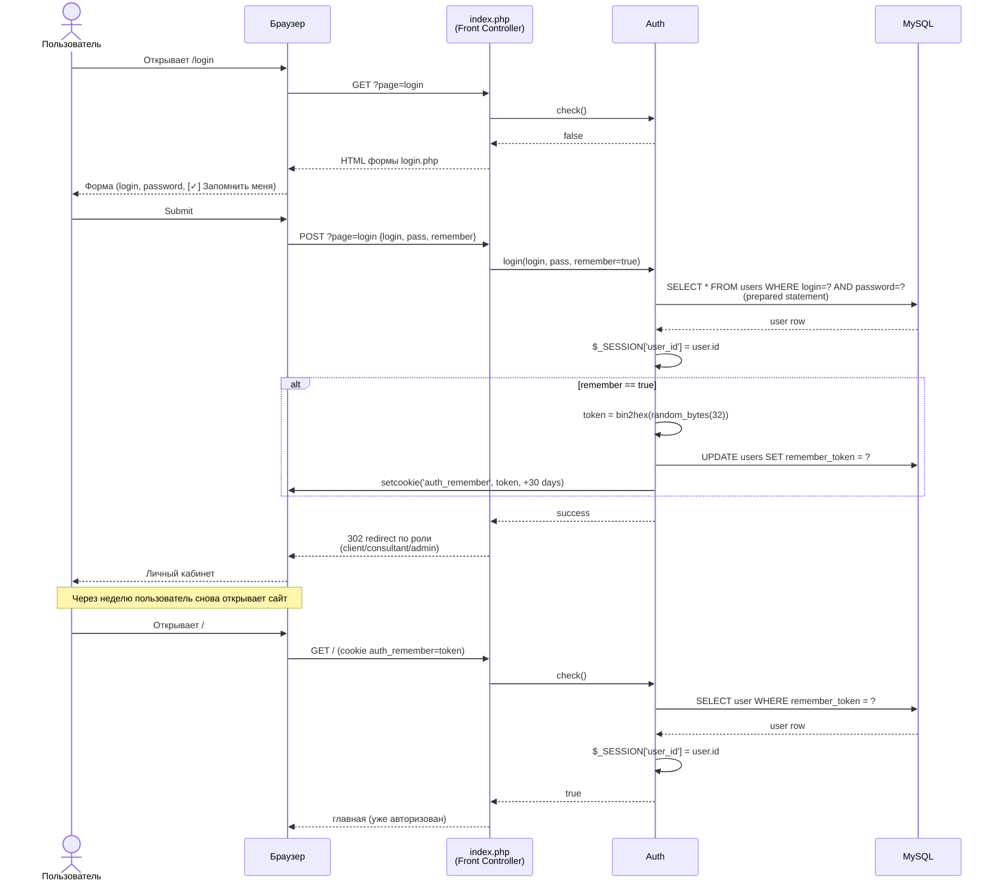

---

## 7. Sequence: Создание заявки клиентом

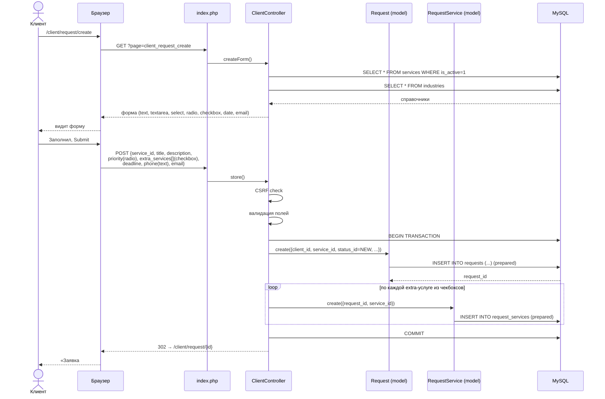

---

## 8. Sequence: Назначение консультанта администратором

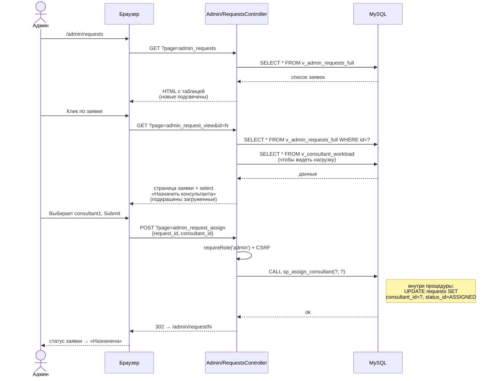

---

## 9. Sequence: Работа консультанта и формирование отчёта

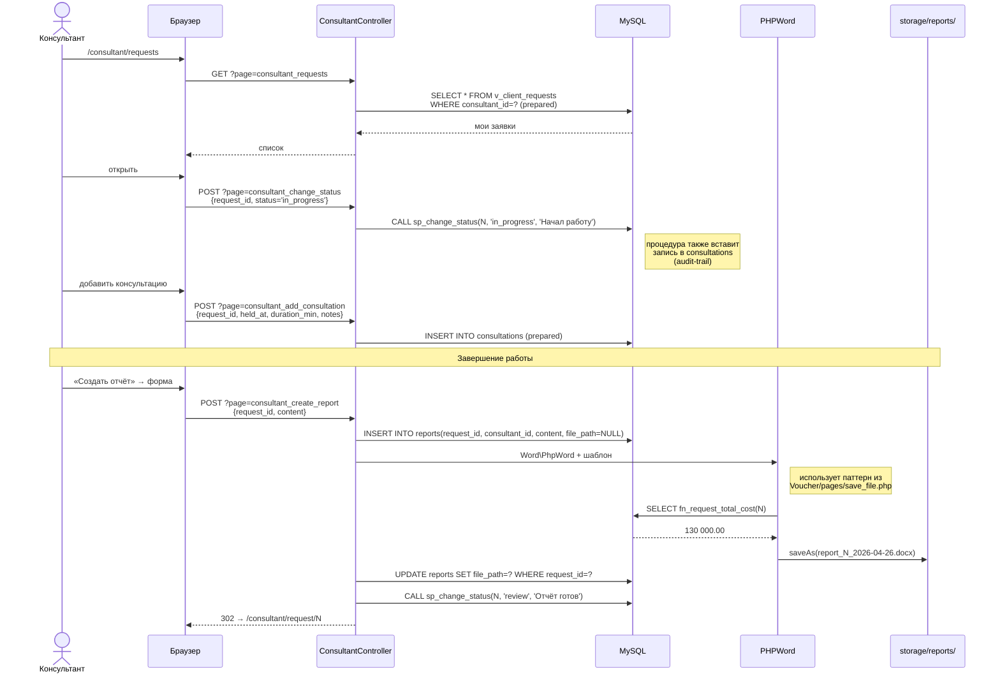

Клиент потом скачивает отчёт:

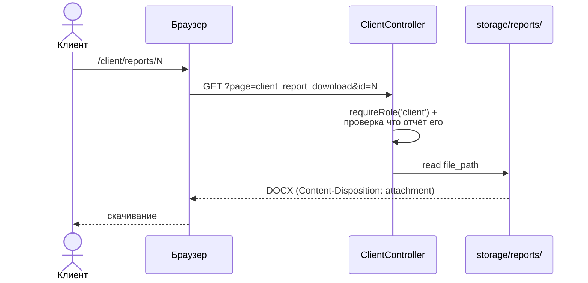

---

## 10. Sequence: Массовое удаление с чекбоксами

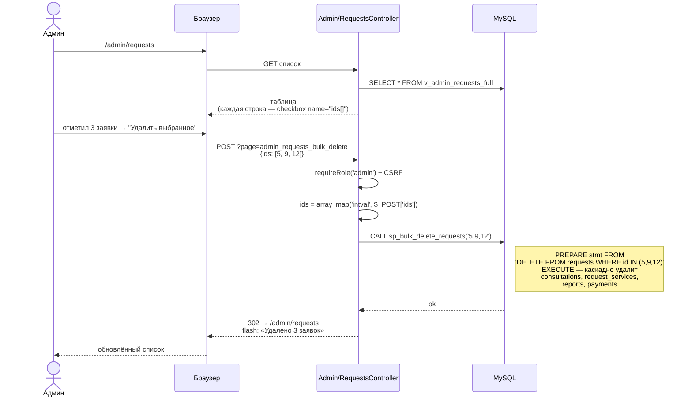

---

## 11. Sequence: GD-диаграммы в админке

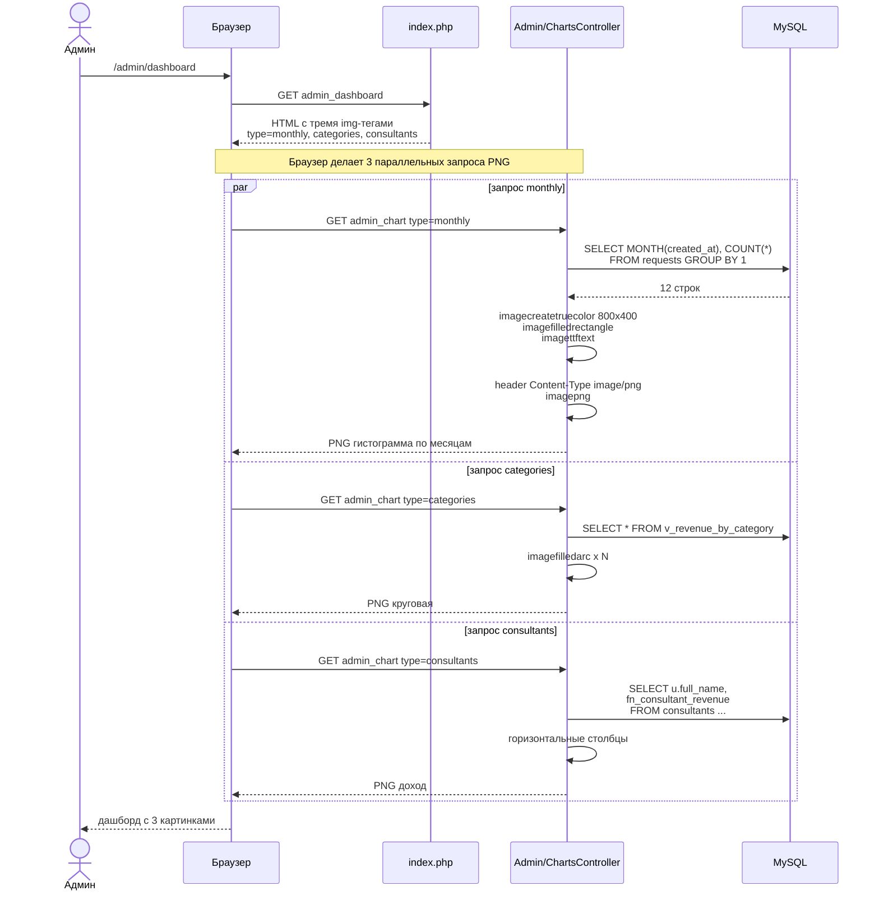

---

## 12. Карта ролей и разделов сайта

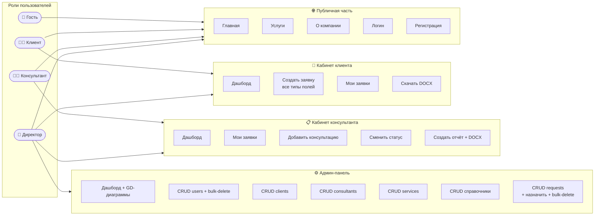

---

## Связь со схемой БД

| Sequence-сценарий | Какие таблицы / VIEW / процедуры задействованы |
|---|---|
| §6 Логин с кукой | `users` (SELECT prepared), session, cookie `auth_remember` |
| §7 Создание заявки | `requests` INSERT, `request_services` INSERT (M:N), транзакция |
| §8 Назначение консультанта | `sp_assign_consultant` → `requests` UPDATE; чтение `v_consultant_workload` |
| §9 Работа консультанта | `sp_change_status`, `consultations` INSERT, `reports` INSERT, `fn_request_total_cost`, PHPWord → DOCX |
| §10 Массовое удаление | `sp_bulk_delete_requests` → каскад на consultations/request_services/reports/payments |
| §11 GD-диаграммы | `v_revenue_by_category`, `fn_consultant_revenue`, `requests` GROUP BY |

---

